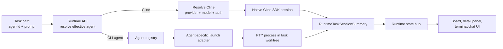
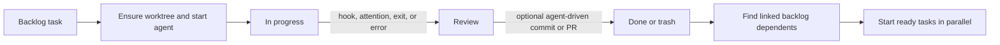

# Cline Kanban agent orchestration research

## Status

- **Status:** Implementation input; not a Vorchestra product decision
- **Researched:** 2026-07-09
- **Kanban source:** `/Users/vrana/Development/kanban`
- **Kanban revision:** `651a9b1b8d20c9092cd85effed930e67049ff559`
- **Scope:** Agent selection, launch, isolation, lifecycle, dependency chaining,
  state streaming, and persistence

This note records how the local Cline Kanban project runs multiple coding agents
and what that architecture implies for Vorchestra's proposed AI Agent block. The
Kanban repository was inspected as a read-only reference. This is a research
document, not a decision to copy Kanban's execution model.

## Executive answer

Kanban does something directionally similar to the proposed Vorchestra block:
the user selects an agent from a common UI, and agent-specific code prepares the
actual runtime while the rest of the application consumes a shared session
summary.

It does **not** use the exact abstraction proposed in the current v0.2 target:

- Kanban's top-level selector chooses an **agent runtime** such as Codex,
  Claude, Kiro, or native Cline.
- Only native Cline exposes a second **provider** selector and a **model**
  selector. In that path, provider means the LLM backend used inside the Cline
  SDK.
- CLI agents run as long-lived interactive PTY sessions in per-task Git
  worktrees. They do not run as one-shot DAG blocks with typed input and output
  artifacts.
- Native Cline bypasses the PTY adapter path and uses an SDK-owned chat session,
  provider store, OAuth flow, and persisted message history.

The comparison validates Vorchestra's proposed UI-specific compiler boundary,
but it reveals a naming problem: **Codex is an agent runtime, not an LLM
provider, in Kanban's model.** Vorchestra should call the first selector
`Agent`, `Runtime`, or `Agent runtime`, and reserve `Provider` for a future
runtime that genuinely selects among model/API providers.

## Terminology

The following terms are distinct in Kanban:

| Term          | Meaning in Kanban                                            | Example                                    |
| ------------- | ------------------------------------------------------------ | ------------------------------------------ |
| Agent runtime | The executable or SDK implementation that performs a task    | Codex, Claude, Kiro, Cline                 |
| Provider      | The model/API backend used by native Cline                   | OpenAI Codex, Cline, Anthropic, OpenRouter |
| Model         | A model available through the selected native Cline provider | A provider-specific model ID               |
| Task          | A board card containing the prompt and execution preferences | A backlog or in-progress card              |
| Task session  | The live agent instance associated with a task               | A PTY process or native Cline SDK session  |
| Worktree      | An isolated Git checkout created for a task                  | `.cline/worktrees/<task>`                  |

Kanban's persisted card contract reflects this separation. `agentId` selects the
runtime. Optional `clineSettings` contains `providerId`, `modelId`, and
reasoning effort only for native Cline. The task editor renders the provider and
model controls only when the effective agent is `cline`.

## System shape

Kanban is a local browser control surface over a local Node runtime. The
runtime, not the browser, owns live sessions and process state. It has two
execution paths behind a mostly shared API and state envelope.



This is a useful capability boundary. The common contract covers lifecycle and
presentation state, while each runtime retains the behavior needed to launch and
observe it.

## 1. Agent catalog and selection

The agent catalog defines stable IDs, display names, binary names, base
arguments, autonomous arguments, and installation links. At the inspected
revision the catalog includes Claude, Codex, Cline, OpenCode, Droid, Kiro, and
Gemini. A narrower launch-supported list controls what the current runtime
actually offers.

Kanban supports two levels of preference:

1. A workspace default agent.
2. An optional per-task agent override stored on the card.

At session start, the runtime resolves the effective agent in this order:

1. A previous terminal agent when restoring a trashed session.
2. The card's `agentId` override.
3. The workspace default.

If the result is native Cline, task-level `clineSettings` can override the
default Cline provider, model, and reasoning profile. Those settings are not
used for Codex CLI or the other CLI agents.

### Consequence for Vorchestra

The selector pattern is reusable, but the current v0.2 wording should not call
`Codex` a provider. A durable neutral contract would look conceptually like:

```text
block kind: AI Agent
agent runtime: codex
instruction: ...
runtime-neutral fields: context, working directory, authority, response output
runtime-specific settings: codex model override, if any
```

The selected runtime must be stored explicitly. Inferring it later from an
executable name would make migrations and UI restoration unreliable.

## 2. CLI agent launch path

Most Kanban agents use the same process-oriented launch pipeline:

1. Resolve the task and ensure its Git worktree exists.
2. Resolve the selected agent's binary through direct PATH inspection.
3. Pass a neutral launch request to the agent adapter.
4. Let the adapter compile provider-specific arguments, environment, temporary
   configuration, startup input, and lifecycle detectors.
5. Spawn the prepared command directly with `node-pty` in the task worktree.
6. Normalize output and process transitions into a shared task-session summary.

The session manager keeps a map keyed by task ID, so multiple task processes can
be alive concurrently. It owns input, resize, stop, stale-session recovery, and
bounded restart behavior. PTY process termination also attempts to terminate the
POSIX process group.

### Why adapters exist

These CLIs do not share one launch contract. Their adapters handle differences
such as:

- autonomous or plan-mode flags;
- resume commands;
- prompt placement in arguments or deferred terminal input;
- temporary hook configuration;
- trusted-workspace prompts;
- output patterns that mean the task needs review;
- image argument preparation;
- runtime-specific environment variables.

For example, the Codex adapter can prepare a resume command, defer a `/plan`
submission, inject hook/trust configuration, and detect Codex terminal state.
Other adapters perform their own equivalent translations.

### Important safety difference

Kanban's autonomous modes include high-authority flags such as Codex's
`--dangerously-bypass-approvals-and-sandbox`, Cline CLI's `--auto-approve-all`,
and Kiro's `--trust-all-tools`. It also auto-confirms some workspace trust
prompts because each task normally runs in a managed worktree.

That policy is specific to Kanban's research-preview task runner. It should not
be inherited by Vorchestra. Vorchestra's stated trust model requires visible
authority, a read-only Codex default, and no generated approval or sandbox
bypass flags.

## 3. Native Cline execution path

Native Cline is not treated as just another command adapter. The runtime routes
it through a dedicated SDK integration because it has richer semantics:

- provider and model catalogs;
- API credential and OAuth flows;
- chat messages and image attachments;
- plan/act interaction;
- turn cancellation and session abortion;
- persisted session history and session rebinding;
- context-overflow compaction;
- SDK-native event handling.

A provider service is the Kanban-facing boundary over the SDK provider store. It
resolves provider settings, models, credentials, OAuth refresh, and launch
configuration. A task-session service maps Kanban task IDs to SDK sessions and
adapts messages and lifecycle into the common session summary.

The SDK remains authoritative for provider secrets and native session history.
Kanban deliberately avoids copying those secrets into its generic runtime
configuration.

### Architectural lesson

The valuable pattern is capability-based routing, not the special name `cline`.
A future runtime with chat, resume, structured tool events, or provider-managed
authentication may deserve a richer adapter boundary than a process compiler.
Vorchestra v0.2 does not need that complexity for a one-shot local `codex exec`
block.

## 4. Parallelism and worktree isolation

Kanban's unit of parallelism is the task session. Each normal task gets a
dedicated Git worktree under `.cline/worktrees`, and its selected agent runs
with that worktree as the current directory. This provides:

- filesystem isolation between concurrently running coding agents;
- an independent branch and diff per task;
- cleanup when a task is completed or discarded;
- per-turn checkpoints for reviewing changes.

The home sidebar agent is an exception. It uses a synthetic project-scoped
session ID and works in the project workspace rather than pretending to be a
normal task with a worktree.

### Architectural lesson

Worktrees are central to Kanban because its agents are expected to edit source
trees concurrently. They are not a generic requirement for an AI Agent block.
Vorchestra must decide explicitly whether an agent block:

- works in the workflow's selected directory and participates in ordinary
  process semantics; or
- receives an isolated workspace with merge or export semantics.

For v0.2, the first option is consistent with existing process blocks and the
portable DAG contract. Silent worktree creation would introduce branch, cleanup,
artifact, and conflict semantics that the engine does not currently define.

## 5. Board-level orchestration

Kanban does not implement a general agent DAG scheduler. It implements task
lifecycle orchestration around board columns and dependency links.



A dependency pairs a waiting backlog task with a prerequisite task. When the
prerequisite leaves Review for Done or Trash, linked backlog tasks become ready.
The UI then starts the ready tasks concurrently and moves them to In Progress.
The CLI command path contains related transition behavior.

This is narrower than a workflow DAG:

- dependencies gate task starts but do not route typed artifacts;
- the useful output is commonly a worktree, diff, commit, or PR;
- there is no port contract between agents;
- completion is tied to board state and review policy, not only process exit;
- multiple dependents may start after one prerequisite completes.

### Auto-review and follow-on work

Kanban can ask an agent to perform a commit or PR action after a task reaches
Review. It sends a generated instruction to the active native Cline chat or PTY
session, watches the worktree become clean, then moves the task forward. That
transition can release linked backlog tasks.

Some of this orchestration lives in browser hooks, with similar behavior also
available through CLI commands. This works for Kanban's interactive product but
is not the authority model Vorchestra should adopt. Vorchestra's UI-independent
engine should remain the sole authority for DAG readiness, artifact routing,
failure propagation, and terminal states.

## 6. Hooks and lifecycle interpretation

Process exit alone is not enough to describe an interactive coding-agent task.
Kanban combines several signals:

- PTY output and exit status;
- provider-specific output detectors;
- hook events for prompts, permissions, tool activity, and stop conditions;
- for Codex, a fallback reader over Codex session rollout data;
- user stop, interruption, and review actions.

Those signals are normalized into states such as `idle`, `running`,
`awaiting_review`, `failed`, and `interrupted`, plus a review reason such as
attention, exit, error, interruption, or hook activity. The shared summary also
holds the agent ID, workspace path, process identity, timing, latest tool or
message activity, and turn checkpoints.

### Architectural lesson

A common lifecycle envelope above heterogeneous runtimes is worth preserving.
Provider-private event parsing is not required for Vorchestra v0.2. The proposed
one-shot Codex block can use ordinary process launch, stdout, stderr, exit code,
cancellation, and timing. JSONL translation, tool-event streaming, and resume
should remain deferred until Vorchestra defines durable event and replay
semantics.

## 7. Runtime state streaming

Kanban's runtime state hub is the central fanout point for live state. It
subscribes to both the terminal session manager and native Cline session
service, batches session-summary updates, and broadcasts snapshots and deltas to
workspace clients over WebSocket. Native Cline messages are streamed alongside
the normalized session summaries.

This lets board and detail views remain reactive without making the browser the
source of process truth. It also allows the two execution paths to share most
lifecycle presentation while retaining different detail surfaces: terminal for
CLI agents and chat for native Cline.

### Architectural lesson

Vorchestra already separates artifacts from runtime events. Its AI Agent block
should feed the existing runtime-event path rather than inventing an AI-only
status store. Rich runtime-specific details can be additional inspectable events
later, but they should not become routed artifacts by accident.

## 8. Persistence boundaries

Kanban stores workspace product state under its local runtime home. The board,
session summaries, and metadata are separated into `board.json`,
`sessions.json`, and `meta.json`. Writes are lock-protected and atomic, and a
revision number supports conflict detection.

Native Cline's message/session artifacts and provider credentials remain under
SDK ownership instead of being folded into the generic board files.

The useful boundary is:

| State                                       | Owner                    |
| ------------------------------------------- | ------------------------ |
| Task intent and selected agent runtime      | Kanban board state       |
| Generic task lifecycle summary              | Kanban session state     |
| Worktree and Git lifecycle                  | Kanban workspace layer   |
| Native Cline messages and session artifacts | Cline SDK integration    |
| Native Cline credentials and OAuth          | Cline SDK provider store |

### Architectural lesson

Vorchestra should continue separating portable workflow intent from local run
history and runtime-owned authentication. The workflow may persist the selected
agent runtime and editor metadata, but it should not copy Codex authentication,
ambient config, or provider-native session records.

## Kanban compared with the proposed Vorchestra block

| Concern                 | Cline Kanban                        | Vorchestra v0.2 implication                             |
| ----------------------- | ----------------------------------- | ------------------------------------------------------- |
| User-facing abstraction | Task chooses an agent runtime       | AI Agent block should choose an agent runtime           |
| Codex classification    | CLI agent                           | Do not label Codex as an LLM provider                   |
| Provider selection      | Only inside native Cline            | Reserve the term for a future nested capability         |
| Execution shape         | Interactive PTY session             | Prefer one-shot non-interactive `codex exec`            |
| Isolation               | Per-task Git worktree               | Use explicit working-directory semantics for v0.2       |
| Data flow               | Prompt, terminal/chat, Git changes  | Typed text input and text artifact output               |
| Lifecycle               | Hooks, attention, review, exit      | Existing process runtime events and DAG terminal states |
| Runtime extension       | Agent-specific launch adapters      | Desktop-layer compiler to a generic process block       |
| Shared contract         | Common task-session summary         | Existing engine process and runtime-event contracts     |
| Authentication          | CLI-owned or Cline SDK-owned        | Reuse local Codex authentication; store no keys         |
| Authority default       | Autonomous bypass options available | Read-only default; no generated bypass flags            |
| Resume                  | CLI- and SDK-specific support       | Defer until replay/session semantics exist              |
| Orchestration           | Board links release follow-on tasks | Engine DAG routes artifacts and owns readiness          |

## What Vorchestra should reuse

1. **An explicit runtime identity.** Persist the selected agent runtime instead
   of deriving it from the compiled executable.
2. **A registry plus compiler boundary.** Put runtime-specific translation in
   the desktop layer while the engine continues to execute generic processes.
3. **Capability descriptions.** Describe whether a runtime supports model
   overrides, images, resume, structured events, and workspace writes rather
   than scattering ID checks through the UI.
4. **A common lifecycle envelope.** Keep status, timing, diagnostics,
   cancellation, and failure under the existing runtime-event model.
5. **Runtime-owned authentication.** Let the local CLI own login and
   credentials.
6. **Visible effective configuration.** Show the compiled executable, arguments,
   environment bindings, stdin mapping, working directory, and authority before
   execution.
7. **Preflight.** Detect an unavailable runtime before starting the workflow and
   translate launch/auth failures into actionable typed failures.

## What Vorchestra should not copy for v0.2

1. Interactive PTY/TUI session management for the first Codex block.
2. Automatic approval, sandbox, or trust bypass flags.
3. Hidden appended system prompts or provider-specific instruction mutation.
4. Codex private rollout-file inspection or provider-specific hook ingestion.
5. Session resume before replay and staleness semantics exist.
6. Automatic Git worktree creation without an explicit isolation contract.
7. Browser-owned scheduling or dependency transitions.
8. Cline SDK provider, OAuth, and chat-session infrastructure for a local
   one-shot Codex process.
9. Treating Git changes, commits, or PRs as implicit artifacts.

## Recommended v0.2 boundary

The narrow implementation boundary remains sound with one terminology change:

- Add one `AI Agent` editor block.
- Label its selector `Agent runtime`.
- Offer `Codex` as the only v0.2 runtime.
- Compile its visible configuration in the desktop layer to a generic direct
  process invocation of `codex exec`.
- Keep the compiled process representation authoritative for execution and run
  review.
- Pass optional upstream text through the declared input binding and capture the
  final stdout as a text artifact.
- Keep stderr, status, exit code, timing, cancellation, and authentication
  failures in runtime events.
- Default to read-only authority; expose workspace write as an explicit choice
  that can create or update files in the resolved current working directory.
- Allow declared generated paths to become filesystem-reference artifacts after
  the process succeeds and the ordinary output validation confirms they exist.
- Store no Codex credentials or private session data.
- Add runtime capabilities only when a second agent proves which differences are
  durable.

This keeps the product thesis intact: specialized editors may exist, but they
compile to processes and do not add provider semantics to the engine.

## Resolved v0.2 decisions

The following choices were resolved on 2026-07-09 and are reflected in the v0.2
targets:

1. **Selector terminology:** use `Agent runtime`.
2. **Instruction delivery:** pass the instruction exactly as one CLI argument;
   keep optional connected context as a separate stdin binding.
3. **Workspace behavior:** run in the resolved current working directory and
   defer worktree-backed isolation.
4. **Model configuration:** use the runtime's existing model configuration and
   defer per-block overrides.
5. **Generated files:** keep read-only as the default, but support explicit
   workspace-write authority and declared filesystem-reference outputs in v0.2.

None of these choices requires provider-specific engine behavior.

The deferred alternatives are logged in `docs/roadmap/V0_3_TARGETS.md`.

## Source map

The conclusions above were checked against the following files in the Kanban
snapshot:

- `docs/architecture.md` — stated runtime layers, dual execution paths, state
  ownership, worktrees, and native Cline boundary.
- `src/core/agent-catalog.ts` — agent IDs, binaries, launch support, and
  autonomous arguments.
- `src/core/api-contract.ts` — task cards, `agentId`, `clineSettings`, and the
  shared session-summary schema.
- `web-ui/src/components/task-agent-model-picker.tsx` — agent override UI and
  native-Cline-only provider/model controls.
- `src/trpc/runtime-api.ts` — effective-agent resolution and routing to the PTY
  or native Cline path.
- `src/terminal/agent-registry.ts` — binary discovery and configured agent
  definitions.
- `src/terminal/session-manager.ts` and `src/terminal/pty-session.ts` —
  concurrent task session ownership, direct PTY launch, input, stop, and
  lifecycle handling.
- `src/terminal/agent-session-adapters.ts` — runtime-specific launch compilers
  and output transition detectors.
- `src/terminal/codex-hook-config.ts` and
  `src/commands/hook-events/codex-hook-events.ts` — Codex hooks and fallback
  session-event interpretation.
- `src/cline-sdk/cline-provider-service.ts` — SDK-owned provider, model, auth,
  and launch configuration.
- `src/cline-sdk/cline-task-session-service.ts` — native chat sessions,
  messages, cancellation, persistence, and rebinding.
- `src/workspace/task-worktree.ts` and `src/workspace/task-worktree-path.ts` —
  task worktree creation, location, and cleanup.
- `src/core/task-board-mutations.ts` and
  `web-ui/src/hooks/use-linked-backlog-task-actions.ts` — dependency release and
  follow-on task starts.
- `web-ui/src/hooks/use-review-auto-actions.ts` and
  `web-ui/src/hooks/use-git-actions.ts` — agent-driven commit/PR automation and
  review completion.
- `src/server/runtime-state-hub.ts` — normalized live-state and message fanout.
- `src/state/workspace-state.ts` — separate board/session persistence, atomic
  writes, and revisions.
